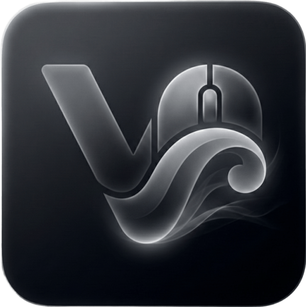

  

<h1 align="center">Scroll-V</h1>

  <b>Buttery smooth scrolling for all Windows applications</b>

  
  
  
  

  Scroll-V brings a "buttery smooth" scrolling experience to all Windows applications, reducing hand fatigue and enhancing the overall aesthetics of your PC experience.

  💖 This project is entirely <b>non-profit</b> and <b>free</b>.  
  If you'd like to support my work, you can donate at my PayPal page: <a href="https://www.paypal.me/PhuocLe678"><b>Donate</b></a>

---

## ✨ Features

- 😍 **Boost your scrolling experience** - Fluid, natural scroll animation that's easy on the eyes
- 🤞 **Prevent RSI** - Scroll acceleration reduces repetitive strain injury risks
- ⚙️ **Highly Customizable** - Adjust smoothness, speed, friction, glide, and animation curves
- 📱 **Per-App Settings** - Exclude specific applications from smooth scrolling (more settings in the future)
- 🔧 **System Tray** - Runs quietly in the background
- 🌐 **Bilingual** - Vietnamese and English language support 
- 💾 **Low Memory** - Optimized RAM usage with auto-cleanup (around 6MB of RAM when running in background)

## 📥 Download & Installation

### Requirements
- Windows 10/11 (64-bit)
- [.NET 8 Desktop Runtime](https://dotnet.microsoft.com/download/dotnet/8.0)

### Installation
1. Download `Scroll-V.zip` from [Releases](https://github.com/rainaku/Scroll-V/releases)
2. Extract to any folder
3. Run `Scroll-V.exe`
4. (Optional) Enable "Start with Windows" in settings

## 🎛️ Settings

### Tuning Options

| Setting | Description | Range |
|---------|-------------|-------|
| **Smoothness** | How smooth the scrolling feels | Very Smooth → Instant |
| **Scroll Speed** | Multiplier for scroll distance | 0.5x → 3.0x |
| **Momentum** | How long scroll continues | Low → Very High |
| **Glide** | Momentum/inertia effect | Subtle → Maximum |
| **Animation** | Easing function for animation | Linear, EaseOut, Elastic, etc. |

### Animation Curves

- **Linear** - Constant speed throughout
- **Ease Out Quad** - Default, natural deceleration
- **Ease Out Cubic** - Smooth, gradual stop
- **Ease Out Expo** - Quick start, slow finish
- **Ease Out Circ** - Circular motion feel
- **Ease In Out Quad** - Smooth start and end
- **Elastic** - Bouncy, playful feel
- **Back** - Slight overshoot effect

## 🔧 Special Features

### Ctrl+Scroll Zoom
When holding **Ctrl** and scrolling, smooth scroll is automatically disabled to allow normal zoom functionality in browsers and other apps.

### Excluded Apps
You can exclude specific applications (useful for video players, design software):

## 📱 System Requirements

| Component | Requirement |
|-----------|-------------|
| OS | Windows 10/11 (64-bit) |
| Runtime | .NET 8 Desktop Runtime |
| RAM | ~20-30 MB |
| CPU | Minimal usage |

## 🔧 Technical Details

- Built with **WPF (.NET 8)**
- Uses **low-level mouse hooks** for system-wide scrolling
- **120 FPS** animation engine
- **JSON-based settings** stored in `%AppData%\Scroll-V\settings.json`
- Automatic **memory optimization** when running in background

## ⌨️ Usage

| Action | Result |
|--------|--------|
| Close Window | Minimize to tray |
| Double-click Tray Icon | Open settings |
| Right-click Tray Icon | Context menu |
| Ctrl + Scroll | Normal scroll (for zoom) |
| Click Flag Icons | Switch language (VN/EN) |

## 📝 Changelog

### v1.0.0
- Initial release
- Smooth scrolling engine with multiple easing functions
- Glide/momentum effect for buttery smooth feel
- Per-application exclusion settings
- Modern glassmorphism UI with animations
- Vietnamese and English language support
- System tray integration
- Start with Windows option
- Ctrl+Scroll bypass for zoom
- Memory optimization

## 🤝 Contributing

Feel free to submit issues and pull requests!

## 📄 License

MIT License - Feel free to use, modify, and distribute.

---

**Made with ❤️ by [rainaku](https://rainaku.id.vn)**

